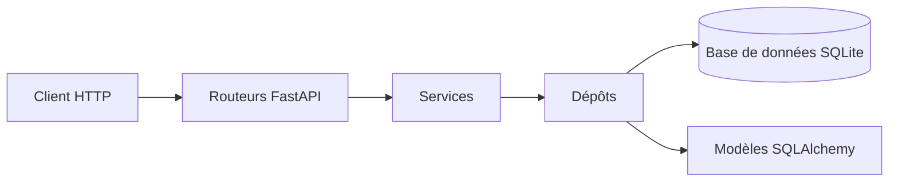

# api-jeux

API REST du catalogue de jeux vidéo — permet de consulter, créer et gérer des jeux, des éditeurs et des utilisateurs.

## Prérequis

- Python 3.12
- PostgreSQL 16 (ou Docker Desktop 4.x)
- Git

## Démarrage rapide

### Avec Docker (recommandé)

```bash
git clone https://github.com/hassanasma501-cloud/api-jeux-gr1.git
cd api-jeux-gr1
docker compose up --build
```

Windows (PowerShell) :
```powershell
git clone https://github.com/hassanasma501-cloud/api-jeux-gr1.git
cd api-jeux-gr1
docker compose up --build
```

Ouvrez http://localhost:8000/docs : la liste des routes s'affiche.

---

### Sans Docker

```bash
git clone https://github.com/hassanasma501-cloud/api-jeux-gr1.git
cd api-jeux-gr1
python -m venv .venv
source .venv/bin/activate          # Windows : .venv\Scripts\activate
pip install -r requirements-dev.txt
cp .env.example .env               # Windows : copy .env.example .env
# Dans .env, remplacez ces deux lignes :
#   DATABASE_URL=sqlite:///./jeux.db
#   ORIGINES_AUTORISEES=["http://localhost:5173"]
python scripts/peupler.py
fastapi dev app/main.py
```

Ouvrez http://localhost:8000/docs : la liste des routes s'affiche.

## Configuration

L'application utilise un fichier `.env` pour sa configuration. Copiez `.env.example` en `.env` et renseignez les variables obligatoires. Ne commitez jamais ce fichier.

| Variable | Rôle | Obligatoire | Valeur par défaut |
| :--- | :--- | :--- | :--- |
| `DATABASE_URL` | Adresse de connexion à la base de données | Oui | — |
| `CLE_SECRETE` | Clé utilisée pour signer les jetons | Oui | — |
| `ALGORITHME_JETON` | Algorithme de chiffrement des jetons | Non | `"HS256"` |
| `DUREE_JETON_MINUTES` | Durée de validité d'un jeton (en minutes) | Non | `30` |
| `ORIGINES_AUTORISEES` | Liste des domaines autorisés (CORS) | Non | `["http://localhost:5173"]` |
| `ENVIRONNEMENT` | Définit si l'API est en développement ou production | Non | `"developpement"` |
| `NIVEAU_JOURNAL` | Niveau de verbosité des logs | Non | `"INFO"` |
| `ECHO_SQL` | Affiche ou non les requêtes SQL dans les logs | Non | `False` |
| `MAX_TENTATIVES_CONNEXION` | Nombre maximum d'essais de connexion | Non | `5` |
| `FENETRE_TENTATIVES_MINUTES` | Fenêtre de temps pour bloquer les tentatives (en min) | Non | `15` |

Générez une clé secrète sécurisée :
```bash
python -c "import secrets; print(secrets.token_urlsafe(32))"
```

## Utilisation

L'API documente automatiquement toutes ses routes. Une fois le serveur lancé, ouvrez http://localhost:8000/docs pour consulter la documentation interactive et tester l'API.

Exemples de requêtes :

- Récupérer la liste des jeux : `GET /api/v1/jeux`
- Consulter les statistiques du catalogue : `GET /api/v1/jeux/statistiques`

## Tests

Pour lancer l'ensemble des tests :

```bash
pytest
```

Pour vérifier la qualité du code avec le linter :

```bash
ruff check .
```

Les tests doivent tous passer et `ruff check .` ne doit signaler aucune erreur.

## Architecture

L'API est organisée en plusieurs couches afin de séparer les responsabilités.



Principaux dossiers de `app/` :

- `routeurs/` : définit les routes HTTP de l'API et reçoit les requêtes des clients.
- `services/` : contient la logique métier de l'application.
- `depots/` : gère l'accès aux données et les requêtes vers la base de données.
- `tables/` : contient les modèles SQLAlchemy représentant les tables de la base de données.

Le fichier `main.py` initialise l'application FastAPI et charge les routeurs.

Le fichier `config.py` centralise la configuration de l'application et les variables d'environnement.

## Contribuer

Le travail collaboratif suit le principe suivant :

1. Une issue est créée pour décrire le bug ou l'évolution à traiter.
2. Une branche dédiée est créée à partir d'un `main` à jour.
3. Les modifications sont réalisées et enregistrées avec des commits explicites.
4. La branche est poussée sur GitHub et une Pull Request est ouverte.
5. Un autre membre de l'équipe relit la Pull Request et laisse ses commentaires.
6. Après validation de la relecture, la Pull Request est fusionnée dans `main`.
7. La branche de travail est ensuite supprimée.
