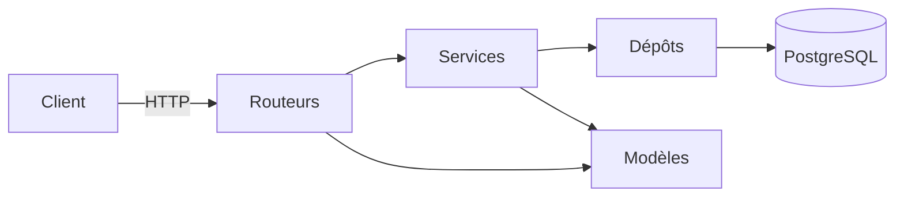

# api-jeux

API REST du catalogue de jeux vidéo — permet de consulter, créer et gérer des jeux, des éditeurs et des utilisateurs.

## Prérequis

- Python 3.12
- PostgreSQL 16 (ou Docker Desktop 4.x)
- Git

## Démarrage rapide

### Avec Docker (recommandé)

```bash
git clone https://github.com/hassanasma501-cloud/api-jeux-gr1.git
cd api-jeux-gr1
docker compose up --build
```

Windows (PowerShell) :
```powershell
git clone https://github.com/hassanasma501-cloud/api-jeux-gr1.git
cd api-jeux-gr1
docker compose up --build
```

Ouvrez http://localhost:8000/docs : la liste des routes s'affiche.

---

### Sans Docker

```bash
git clone https://github.com/hassanasma501-cloud/api-jeux-gr1.git
cd api-jeux-gr1
python -m venv .venv
source .venv/bin/activate          # Windows : .venv\Scripts\activate
pip install -r requirements.txt
cp .env .env.local                 # Windows : copy .env .env.local
# Remplissez DATABASE_URL et CLE_SECRETE dans .env.local
fastapi dev app/main.py
```

Ouvrez http://localhost:8000/docs : la liste des routes s'affiche.

## Configuration

L'application utilise un fichier `.env` pour sa configuration. Copiez `.env` et renseignez les variables obligatoires. Ne commitez jamais ce fichier.

| Variable | Rôle | Obligatoire | Valeur par défaut |
| :--- | :--- | :--- | :--- |
| `DATABASE_URL` | Adresse de connexion à la base de données | Oui | — |
| `CLE_SECRETE` | Clé utilisée pour signer les jetons | Oui | — |
| `ALGORITHME_JETON` | Algorithme de chiffrement des jetons | Non | `"HS256"` |
| `DUREE_JETON_MINUTES` | Durée de validité d'un jeton (en minutes) | Non | `30` |
| `ORIGINES_AUTORISEES` | Liste des domaines autorisés (CORS) | Non | `["http://localhost:5173"]` |
| `ENVIRONNEMENT` | Définit si l'API est en développement ou production | Non | `"developpement"` |
| `NIVEAU_JOURNAL` | Niveau de verbosité des logs | Non | `"INFO"` |
| `ECHO_SQL` | Affiche ou non les requêtes SQL dans les logs | Non | `False` |
| `MAX_TENTATIVES_CONNEXION` | Nombre maximum d'essais de connexion | Non | `5` |
| `FENETRE_TENTATIVES_MINUTES` | Fenêtre de temps pour bloquer les tentatives (en min) | Non | `15` |

Générez une clé secrète sécurisée :
```bash
python -c "import secrets; print(secrets.token_urlsafe(32))"
```

## Utilisation

L'API documente automatiquement toutes ses routes. Une fois le serveur lancé, ouvrez http://localhost:8000/docs pour consulter la documentation interactive et tester l'API.

Exemples de requêtes :

- Récupérer la liste des jeux : `GET /api/v1/jeux`
- Consulter les statistiques du catalogue : `GET /api/v1/jeux/statistiques`

## Tests

Lancer tous les tests :
```bash
pytest
```

Lancer un test précis :
```bash
pytest tests/test_api_jeux.py -v
```

Vérifier la qualité du code :
```bash
ruff check .
```

## Architecture



Dossiers du répertoire `app/` :

| Dossier | Rôle |
|---------|------|
| `routeurs/` | Endpoints HTTP — reçoit les requêtes et renvoie les réponses |
| `services/` | Logique métier — règles, validations, exceptions applicatives |
| `depots/` | Accès aux données — requêtes SQL via SQLAlchemy |
| `tables/` | Modèles ORM SQLAlchemy — structure des tables |
| `modeles/` | Schémas Pydantic — validation des entrées et sorties |

## Contribuer

Une issue, une branche, une PR relue — jamais de push direct sur `main`.

1. Créez ou assignez-vous une issue
2. Partez d'un `main` à jour : `git switch main && git pull`
3. Créez une branche : `git switch -c fix/42-mon-correctif`
4. Commitez avec le format conventionnel : `fix(jeux): corriger le tri par note`
5. Poussez et ouvrez une PR avec contexte, changements, impact et `Closes #42`
6. Attendez une relecture avant de fusionner
